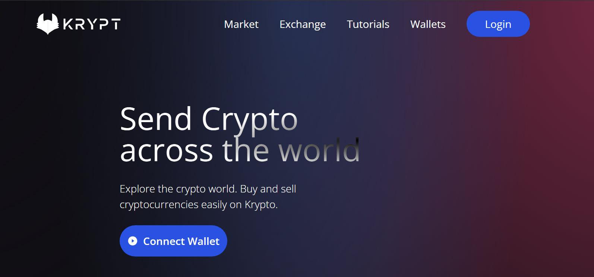
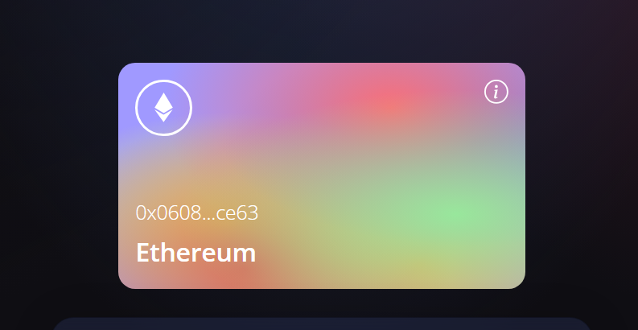

# Web3.0 Blockchain DApp 🚀

A modern decentralized application (DApp) built with React, Vite, Solidity, Ethers.js, and Tailwind CSS. This app allows users to connect their MetaMask wallets, send Ethereum transactions on the Sepolia Testnet, and view transaction history with details.

---

## 📸 Screenshots

### 🔌 Home Page

### 💸 Ethereum Card

### 💸 Demo Transactions

---

## ⚙️ Tech Stack

- **Frontend**: React + Vite
- **Blockchain**: Solidity (Smart Contracts)
- **Ethereum Network**: Sepolia Testnet
- **Wallet**: MetaMask
- **Libraries**: Ethers.js, Tailwind CSS

---

## 🚀 Features

- 🔐 Connect Ethereum wallet (MetaMask)
- 💰 Send ETH transactions with message and keyword
- 🧾 Transaction history shown in card format
- 🔗 Etherscan links for `From` and `To` addresses
- ✂️ Shortened Ethereum addresses
- 🎨 Responsive design with Tailwind CSS

---

## 🙋‍♂️ Connect with Me

- [LinkedIn]((https://www.linkedin.com/in/raghav-gupta-381690284/))  
- [Twitter](https://twitter.com/codesraghav_)

